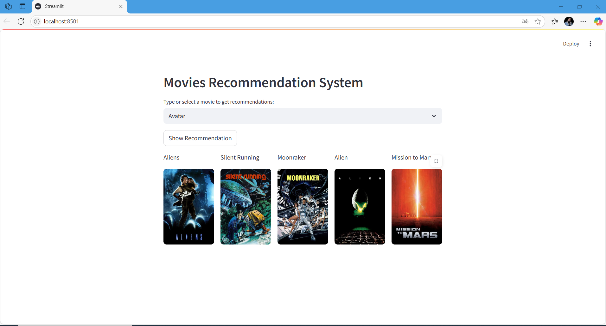

# 🎬 Movie Recommendation System

Un système de recommandation de films intelligent basé sur les préférences des utilisateurs, utilisant des techniques de filtrage collaboratif, de similarité, et des modèles de machine learning.

## 🚀 Fonctionnalités

- 🔍 Recommandation personnalisée de films
- 🎯 Recherche par titre, genre et popularité
- 📈 Analyse des similarités entre les utilisateurs ou films
- 🧠 Utilisation de modèles de machine learning
- 💡 Interface web responsive et intuitive

## 🖼️ Aperçu de l’application

### 🎞️ Détail d’un film et suggestions

